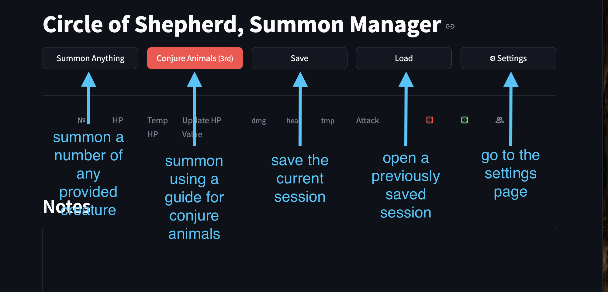
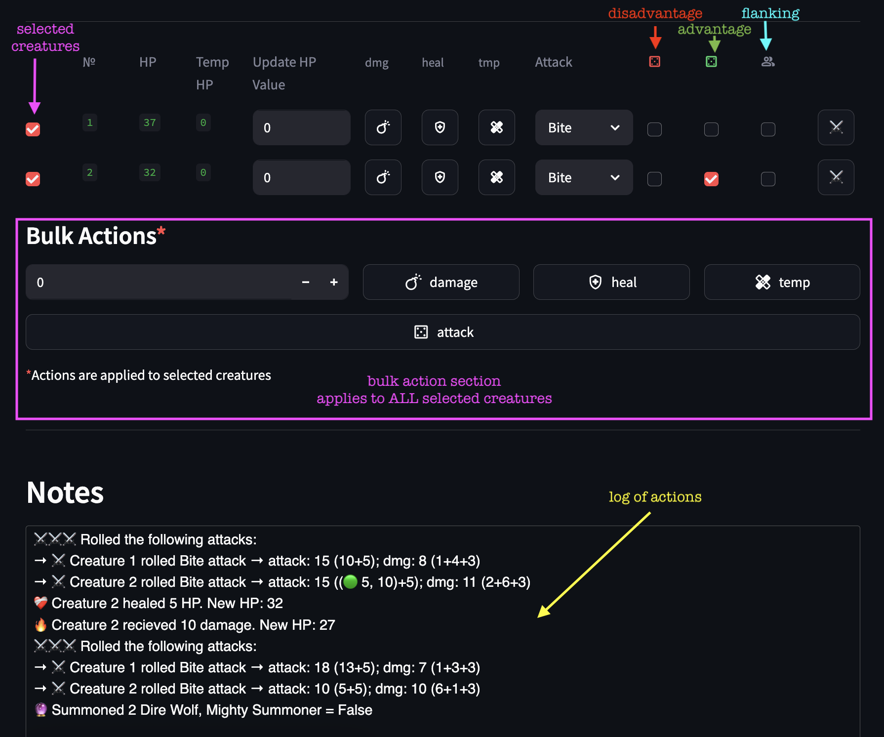

# Circle of the Shepherd Helper Tool
This is a small helper tool that I use to manage my summoned creatures when playing a Circle of the Shepherd druid. It allows you to quickly summon creatures and perform bulk actions like attacking and adding temporary HP. 

## Brief User Guide

When you first open the app you should see the options pictured below.



> [!NOTE]
> Eventually I do plan to add helpful buttons for the other summoning spells, but my CoS druid isn't high enough level for me to care yet

Once you have summoned some creatures you can interact with them in the following ways. The results of any interactions will be seen in the notes section.

- See the creatures number, HP and any temp HP. 
- Apply damage, healing, or temp hp to a creature EITHER by working in it's row of the table or by using bulk actions.
- Attack EITHER with an individual creature or with bulk actions. Either way it will perform the attack selected under the "Attack" column
- Bulk actions (damage, healing, temp HP, and attack) will be applied to ALL selected creatures. You select creatures via the checkboxes on the far left
- Use the checkboxes to mark which creatures have disadvantage, advantage or flanking bonus. Attacks will adjust accordingly.

> [!important]
> My campaign is using a +1 attack flanking bonus. You can choose between that rule and advantage on the settings page



> [!INFO]
> Here I refer to creatures by number to make things easy on myself. In the tokens directory you'll find the numbered tokens that I use. Blank token was generated with Token Stamp 2.

### Adding Creatures
There are currently a very small number of available creatures in the app. I have plans to create an interface for easily adding more, but in the mean time you can add them by following the steps below. 

1. Open `data/creatures.json`
2. Copy the json for an existing creature and edit it accordingly
3. Save the json file
4. Open the app and go to the settings page
5. Use the checkboxes to make creatures available on the main page (I get easily overwhelmed with too many options)
6. Save the new settings
7. Go to the main page and confirm that your creature is available

## Setup & Run Locally

> [!NOTE]
> This was written using `Python 3.11.3`. I have not tested it with other versions.

Setup your virtual environment and install the required libraries.

```
python -m venv venv
source venv/bin/activate
pip install -r requirements.txt
```

Run the app:
```
streamlit run shepherd.py
```

> [!TIP]
> If you find the above instructions confusing, you can see some more detailed instructions [here](https://docs.google.com/document/d/1M1-WOCFkEJIbO3SpWQ3fq_LtFIVcFFwyWz37AD7-iC0/edit?usp=sharing).


## TODO
* [ ] add ability to cast conjure animals at higher levels
* [ ] add conjure woodland beings
* [ ] add conjure fey
* [ ] add more creatures
* [ ] make a better way to add creatures (web crawler?)
* [ ] consider multiattack (ex. Polar Bear)